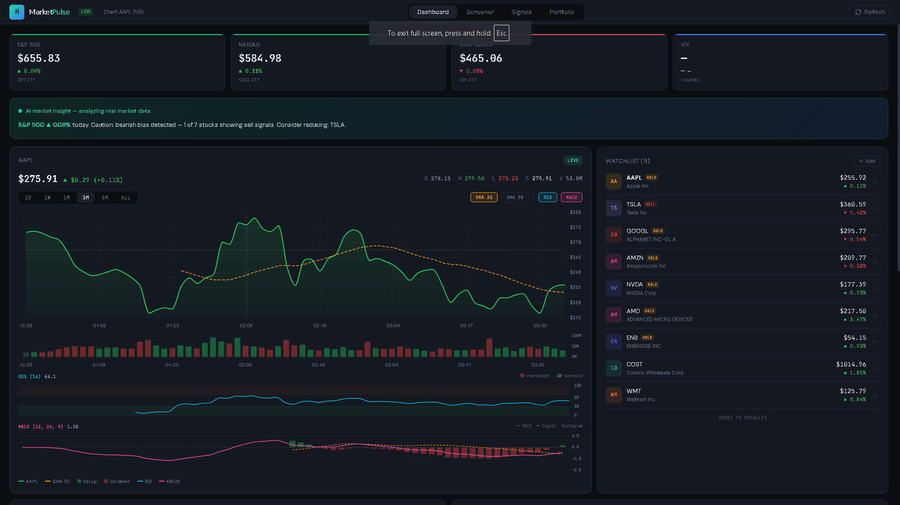
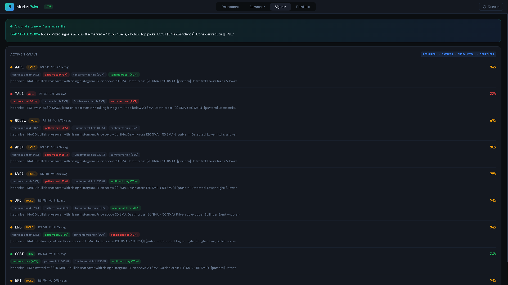
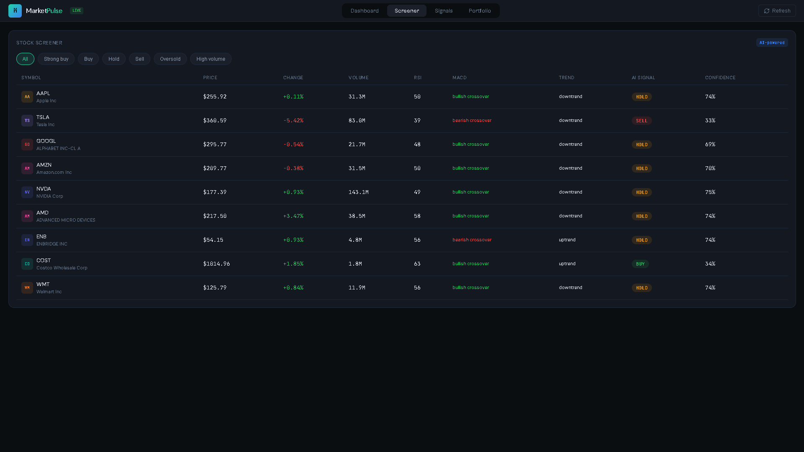
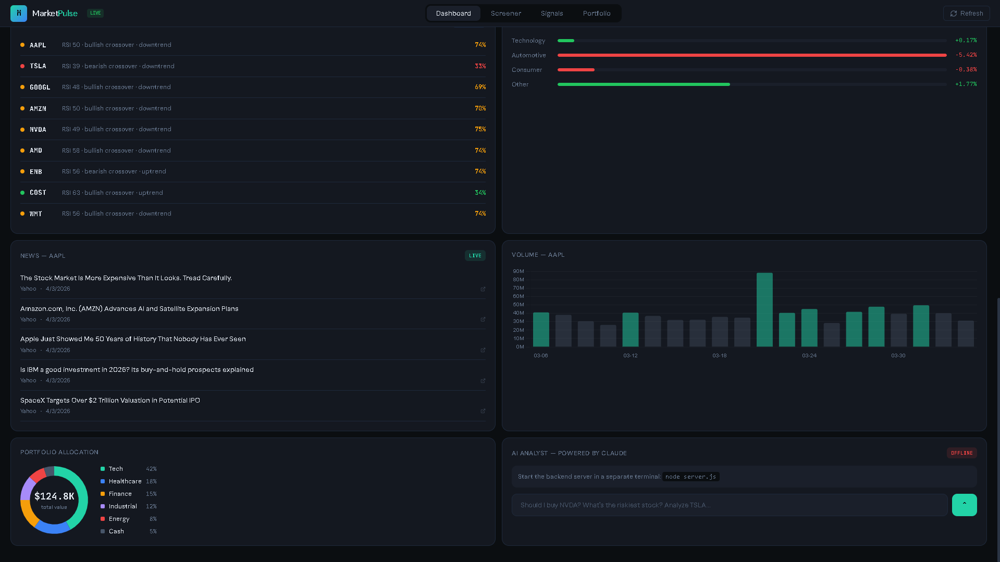

# Market Pulse
### AI-Powered Stock Market Intelligence Platform

<div align="center">


**Real-time market data · 4-skill AI analysis engine · Interactive technical charts · Claude-powered chat**

[Features](#features) · [Architecture](#architecture) · [Setup](#setup) · [Extending](#extending-the-ai-agent)

</div>

---



### More views

<details>
<summary>Click to see more screenshots</summary>

#### AI Signals — 4 skill breakdown per stock


#### Stock Screener with filters


#### News feed, volume chart, portfolio, AI chat


</details>

https://github.com/user-attachments/assets/6ac49a98-5d7f-49aa-b634-bde3e7b61186

## What is this?

Market Pulse is a full-stack stock analysis platform that pulls live market data from multiple sources, runs it through a custom AI agent with 4 independent analysis skills, and presents everything in a professional trading dashboard — with an AI chat assistant that actually understands your portfolio.

It's not a toy project. The AI agent generates real buy/sell/hold signals with confidence scores by combining technical indicators, chart pattern recognition, fundamental metrics, and sentiment analysis. The Claude-powered chat sees all your live data and gives contextual answers.

---

## Features

### Real-Time Market Data
- Live stock quotes via **Finnhub API** with WebSocket streaming
- Historical OHLCV candle data via **Yahoo Finance** (no API key needed)
- Intraday 5-minute charts for current trading day
- Market index tracking through SPY, QQQ, DIA ETFs
- Live company news feed per stock

### Interactive Trading Charts
- **Crosshair cursor** with synchronized OHLCV tooltips
- **SMA 20 / SMA 50** moving average overlays (toggle on/off)
- **RSI panel** with overbought (70) and oversold (30) zones
- **MACD panel** with signal line crossovers and histogram
- **Color-coded volume bars** — green for up days, red for down days
- **6 timeframes** — 1D (intraday), 1W, 1M, 3M, 6M, ALL
- Price and indicator values update live as you hover

### AI Analysis Engine
Four independent analysis modules, each producing a signal:

| Skill | What it analyzes |
|-------|-----------------|
| **Technical** | RSI, MACD, SMA/EMA, Bollinger Bands, ATR, volume patterns |
| **Pattern** | Double tops/bottoms, trend structure, breakouts, consolidation |
| **Fundamental** | P/E ratio, profit margins, revenue growth, 52-week range |
| **Sentiment** | On-Balance Volume, buying pressure, momentum, volume divergence |

Signals are aggregated with configurable weights into a final recommendation with confidence percentage.

### Claude AI Chat
- Natural language stock analysis — ask anything about your watchlist
- **Context-aware** — Claude sees live quotes, signals, RSI, MACD, and all technical data
- Express.js backend keeps the API key secure (never exposed to frontend)
- Conversation history within session

### Custom Watchlist
- Search any stock via Finnhub symbol search
- Add/remove stocks with one click
- Auto-fetches quote and chart data for new additions
- Persists across sessions via localStorage

### Stock Screener
- Filter by: Strong Buy, Buy, Hold, Sell, Oversold (RSI < 35), High Volume
- Shows price, change, volume, RSI, MACD signal, trend, AI signal, and confidence
- Click any row to jump to its chart

### Additional
- Sector performance computed from real stock data
- Portfolio allocation view with donut chart
- Native **Windows desktop app** via Electron with system tray
- Responsive layout

---

## Architecture

```
┌─────────────────────────────────────────────────────────┐
│                    React Frontend                        │
│  ┌──────────┐ ┌──────────────┐ ┌─────────────────────┐  │
│  │Dashboard │ │ Interactive  │ │ Watchlist Manager   │  │
│  │  Tabs    │ │   Charts     │ │ (Search + CRUD)     │  │
│  └──────────┘ └──────────────┘ └─────────────────────┘  │
│         │              │                  │               │
│  ┌──────────────────────────────────────────────────┐    │
│  │              AI Agent Core                        │    │
│  │  ┌──────────┐┌─────────┐┌────────┐┌───────────┐  │    │
│  │  │Technical ││Pattern  ││Fundmntl││Sentiment  │  │    │
│  │  │  Skill   ││ Skill   ││ Skill  ││  Skill    │  │    │
│  │  └──────────┘└─────────┘└────────┘└───────────┘  │    │
│  │              Agent Memory                         │    │
│  └──────────────────────────────────────────────────┘    │
└───────────────┬──────────────────┬───────────────────────┘
                │                  │
    ┌───────────▼──────┐  ┌───────▼────────┐
    │  Market Data APIs │  │ Express Backend │
    │  ┌──────────────┐ │  │  ┌───────────┐ │
    │  │ Finnhub      │ │  │  │ Claude AI │ │
    │  │ (quotes, WS, │ │  │  │ Proxy     │ │
    │  │  news)        │ │  │  └───────────┘ │
    │  ├──────────────┤ │  └────────────────┘
    │  │ Yahoo Finance│ │
    │  │ (candles)    │ │
    │  └──────────────┘ │
    └──────────────────┘
```

---

## Tech Stack

| Layer | Technology |
|-------|-----------|
| Frontend | React 18, Chart.js 4, react-chartjs-2, Recharts, Lucide icons |
| Backend | Express.js — secure proxy for Claude API |
| Desktop | Electron 28 — native Windows app with system tray |
| Market Data | Finnhub (quotes, WebSocket, news, search), Yahoo Finance (OHLCV candles) |
| AI Chat | Claude API (Anthropic) via Express proxy |
| AI Engine | Custom agent with 4 pluggable skill modules + memory system |
| Indicators | RSI, MACD, SMA, EMA, Bollinger Bands, ATR, VWAP, Stochastic, OBV, Fibonacci |

---

## Setup

### Prerequisites

- **Node.js 18+** — [nodejs.org](https://nodejs.org)
- **Finnhub API key** (free, 60 calls/min) — [finnhub.io](https://finnhub.io/)
- **Claude API key** (optional, for AI chat) — [console.anthropic.com](https://console.anthropic.com/)

### Install and Run

```bash
# Clone
git clone https://github.com/DoshiTirth/market-pulse.git
cd market-pulse

# Install dependencies
npm install

# Configure API keys
copy .env.example .env
# Edit .env and add your Finnhub key (required) and Claude key (optional)

# Start the web app
npm start

# In a separate terminal — start AI chat backend
node server.js

# Or run as a desktop app
npm run electron-dev
```

---

## Project Structure

```
market-pulse/
├── server.js                        # Express backend (Claude API proxy)
├── public/
│   └── electron.js                  # Electron main process
├── src/
│   ├── agent/
│   │   ├── AgentCore.js             # Agent orchestrator + signal aggregation
│   │   ├── skills/
│   │   │   ├── TechnicalSkill.js    # RSI, MACD, SMA, Bollinger, ATR
│   │   │   ├── PatternSkill.js      # Chart pattern detection
│   │   │   ├── FundamentalSkill.js  # Valuation + growth metrics
│   │   │   └── SentimentSkill.js    # Volume + momentum analysis
│   │   └── memory/
│   │       └── AgentMemory.js       # Analysis history per symbol
│   ├── components/
│   │   ├── InteractiveChart.jsx     # Charts + RSI/MACD panels
│   │   └── WatchlistManager.jsx     # Custom watchlist with search
│   ├── services/
│   │   ├── stockAPI.js              # Finnhub + Yahoo Finance
│   │   └── aiChat.js                # Claude API client
│   ├── hooks/
│   │   ├── useAgent.js              # AI agent React hook
│   │   └── useStockData.js          # Market data React hook
│   ├── utils/
│   │   └── indicators.js            # Technical indicator library
│   ├── App.jsx                      # Main dashboard
│   └── index.css                    # Design system
└── .env.example
```

---

## Extending the AI Agent

Add a new analysis skill in 3 steps:

**1. Create the skill** — `src/agent/skills/YourSkill.js`

```javascript
export default class YourSkill {
  name = 'your-skill';
  description = 'What it does';

  async analyze(stockData, context) {
    // Your analysis logic
    return {
      signal: 'buy',       // 'buy' | 'sell' | 'hold'
      confidence: 75,       // 0-100
      reasoning: 'Why this signal was generated'
    };
  }
}
```

**2. Register it** — in `AgentCore.js`:
```javascript
import YourSkill from './skills/YourSkill';
this.registerSkill(new YourSkill());
```

**3. Done** — the agent automatically includes your skill in signal aggregation.

---

## API Costs

| Service | Cost | Usage |
|---------|------|-------|
| Finnhub | Free | 60 calls/min — quotes, news, WebSocket, search |
| Yahoo Finance | Free | No key needed — historical candles only |
| Claude API | ~$0.005/query | $5 covers ~1000 conversations |

---

## License

MIT

---

<div align="center">
  <sub>Built by <a href="https://github.com/DoshiTirth">Tirth Doshi</a></sub>
</div>
